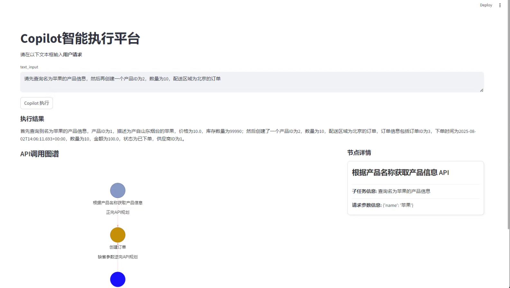

1. 该项目是一个基于REACT的前端框架，使用的UI是antd 组件库
2. 该网页前端包含 Copilot 平台首页，登录页，注册页，API 工具页，大模型配置页，Copilot执行页面。
3. Copilot平台首页背景图是一个有科技感酷炫的图片，然后页面正中央是一个Copilot的logo，logo下面是一个登录按钮和一个注册按钮。点击登录按钮进入登录页面，点击注册按钮进入注册页面。
4. 登录页面是一个antd风格的表单，有昵称，手机号，密码，登录按钮，注册链接。
5. 注册页面是一个antd风格的表单，有昵称，手机号，密码，再次确认密码，注册按钮，登录链接。
6. 用户在登录页面点击注册链接会跳转到注册页面，用户点击登录按钮会跳转到到网页内容页。
7. 用户在注册页面点击登录链接会跳转到登录页面。点击注册按钮注册成功之后会跳转到登录页面。
8. 项目的内容页面是一个antd风格的页面，左边有一个侧边栏，导航栏有四个选项：API工具，大模型配置，Copilot执行。点击API工具会跳转到API工具页，点击大模型配置会跳转到大模型配置页，点击Copilot执行会跳转到Copilot执行页。点击侧边栏的关闭按钮会关闭侧边栏。页面上方也存在导航栏，导航栏最右边有一个退出按钮，点击退出按钮会退出登录。
9. API工具页面，是一个antd风格的页面，页面正中央是一个表格，表格有序号、API名称、API描述、API请求参数、API请求方法、操作这几列。其中操作这一列有一个删除按钮，一个修改按钮。用户点击删除按钮，会弹出一个弹窗让用户二次确认是否删除，点击编辑按钮会弹出一个弹窗，让用户上传json文件进行编辑修改。在表格的左上方有两个按钮，一个按钮叫“清空所有工具”，另外一个按钮叫“上传所有工具”
10. 大模型配置页面：是一个表单用户可以配置大模型的URL，APIKEY，temperature，modelName，表单下有两个按钮，一个按钮是测试大模型配置，另外一个按钮是保存配置。用户点击保存配置之后，系统会弹出让用户将上述配置保存为一个配置名称。
11. Copilot 执行页面，请参考以下样式进行实现。

